I build scalable backend systems and agentic AI applications — from microservices platforms handling real-time messaging and distributed transactions, to LangGraph-based multi-agent pipelines with RAG.

📍 Pune, India &nbsp;|&nbsp; 🎓 VIIT, Pune &nbsp;|&nbsp; 🤝 Open to Backend SWE & AI/ML/GenAI roles

<!-- SNAKE START -->
<picture>
  <source media="(prefers-color-scheme: dark)" srcset="https://raw.githubusercontent.com/vidhan13i/vidhan13i/output/github-contribution-grid-snake-dark.svg" />
  <source media="(prefers-color-scheme: light)" srcset="https://raw.githubusercontent.com/vidhan13i/vidhan13i/output/github-contribution-grid-snake.svg" />
  
</picture>
<!-- SNAKE END -->

## 🚀 About Me

- 🎓 Final-year Computer Engineering student at VIIT, Pune
- 💻 Focused on backend engineering (Django DRF, FastAPI, Flask) and AI/agentic systems (LangGraph, LangChain, RAG)
- ⚡ Comfortable across the stack: microservices, event-driven architecture, distributed transactions
- 🌱 Currently deepening Kafka, Redis, Kubernetes, and distributed systems fundamentals
- 🤝 Open to Backend SWE and AI/ML/GenAI internships & full-time roles

## 🛠 Tech Stack

 

**Backend**

**Data & Messaging**

**DevOps & Cloud**

**AI / ML**

## 🌟 Featured Projects

<table>
<tr>
<td width="50%" valign="top">

### 🏠 [HomeHaven](https://github.com/vidhan13i/homehaven-rental-platform)
**Rental Platform — Microservices**

Production-style rental platform built with **Django DRF**, split into independent services — auth, profile, building, listings, applications, chat, notifications, and reviews.
- Real-time chat via **Django Channels + WebSockets**
- Async tasks with **Celery**, event streaming with **Kafka**, caching with **Redis**
- JWT auth, SAGA-style distributed transactions across services
- CI/CD pipeline with test coverage tracking

</td>
<td width="50%" valign="top">

### 🎓 [EarlyWarningAI](https://github.com/vidhan13i/student-risk-evaluator-ai-rag)
**Multi-Agent Student Risk Evaluator**

A **LangGraph** multi-agent system with a **RAG** pipeline to flag at-risk students, coordinating multiple specialized agents over retrieved context.

</td>
</tr>
<tr>
<td width="50%" valign="top">

### 📷 [CADLens](https://github.com/vidhan13i/CADLens)
**Engineering PDF Balloon Detection**

Computer vision tool built with **OpenCV + Tesseract OCR** to detect and read balloon annotations in engineering drawings. Built as part of an industry project with Factorial24.

</td>
<td width="50%" valign="top">

### 🏘 [RentIndia](https://github.com/vidhan13i/rental-platform-aws-ec2)
**Microservices Flask Platform**

Rental platform deployed on **AWS EC2** with **Docker**, built with Flask microservices.

</td>
</tr>
<tr>
<td width="50%" valign="top">

### 📄 [Dune-rag](https://github.com/vidhan13i/dune-rag)
**RAG PDF Chat**

A Retrieval-Augmented Generation system built to act as a conversational encyclopedia for Frank Herbert's Dune universe.

</td>
<td width="50%" valign="top">

### 🎯 Currently Exploring

- Event-driven architecture & Apache Kafka internals (topics, partitions, consumer groups, delivery guarantees)
- Kubernetes & distributed systems
- Agentic AI system design (multi-agent orchestration, RAG at scale)

</td>
</tr>
</table>

## 📊 GitHub Stats

---

📫 Reach me at **vidhanmanihar@gmail.com** — always happy to talk backend systems, agentic AI, or interesting engineering problems.

